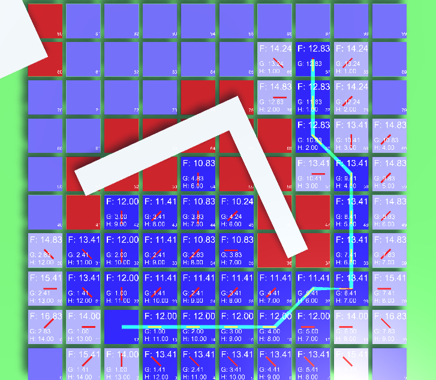

# A* Unity

    

Implementation of the A*-Algorithm in Unity, with various interactions available. Updated to work with Unity 2021.3.10f1, 2023-01

| _ |
:-------------------------:|
|
|

Created by Matthias Zarzecki, 2015-06
